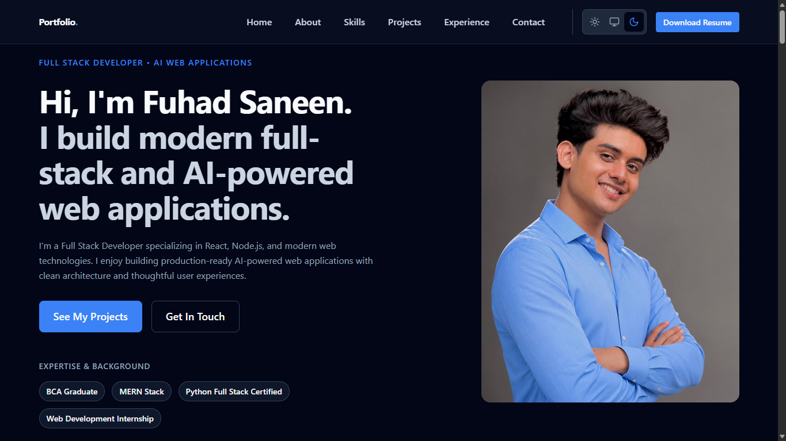
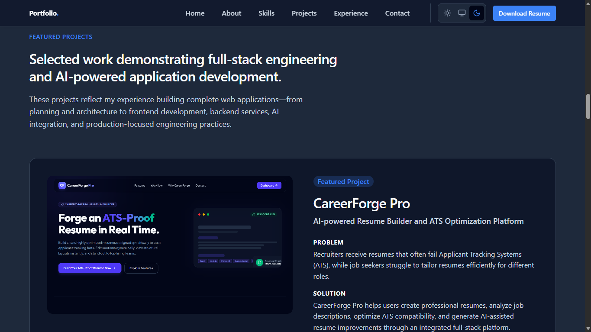
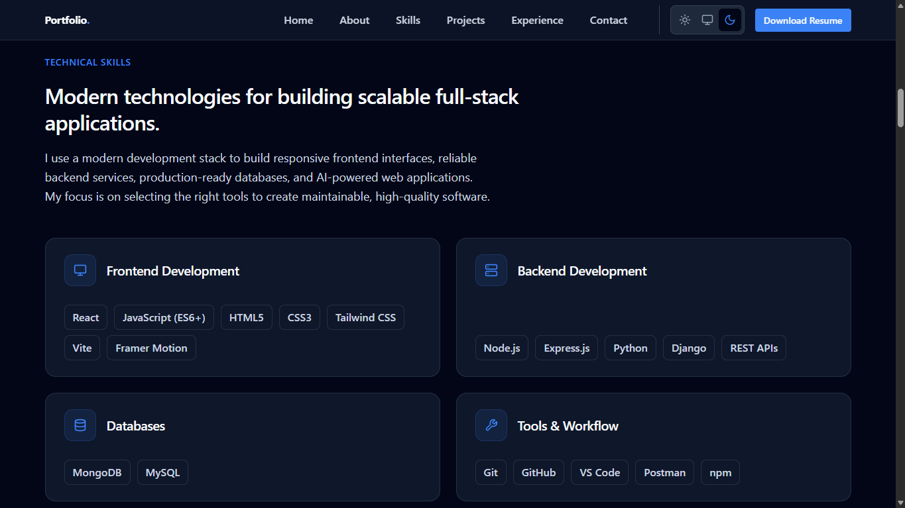
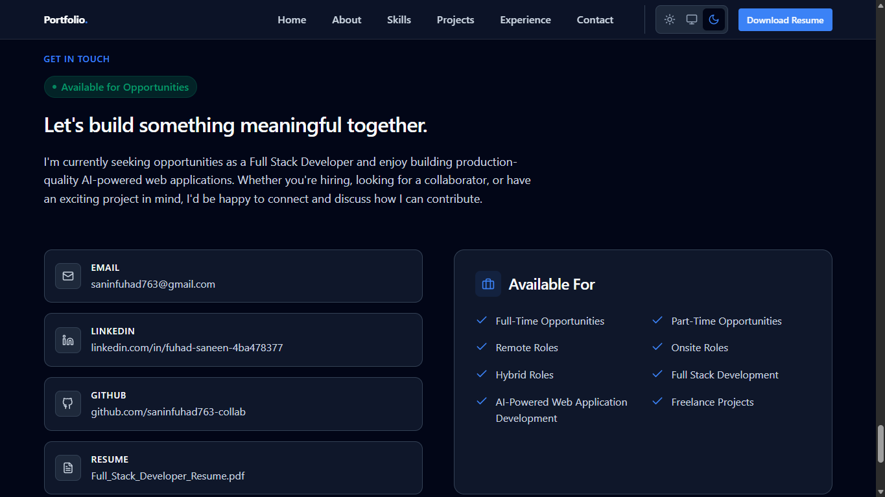

# Fuhad Saneen | Full Stack Developer


A production-grade software engineering portfolio demonstrating modern web development standards.

**[Portfolio (Live Demo)](https://developer-portfolio-iota-flax.vercel.app/)** | **[Contact Me](#contact)**

---

## About

I am a Full Stack Developer specializing in React, Node.js, and AI-powered web applications. This repository contains the source code for my professional portfolio. 

Beyond serving as a resume, this project is a live demonstration of my engineering standards. Visitors can expect a highly optimized, accessible, and responsive application built with clean architecture and meticulous attention to user experience.

---

## Preview

<a href="https://developer-portfolio-iota-flax.vercel.app/">
  
</a>
<br/>
<a href="https://developer-portfolio-iota-flax.vercel.app/">
  
</a>
<a href="https://developer-portfolio-iota-flax.vercel.app/">
  
</a>
<a href="https://developer-portfolio-iota-flax.vercel.app/">
  
</a>

---

## Technical Stack

| Category | Technology |
| :--- | :--- |
| **Frontend Core** | React 19, JavaScript, HTML5, CSS3 |
| **Styling** | Tailwind CSS v4 |
| **Animation** | Framer Motion |
| **Build Tool** | Vite 8 |
| **Deployment** | Vercel |

*(Note: Animations are powered by Framer Motion and optimized to deliver smooth, responsive interactions while maintaining excellent rendering performance).*

---

## Key Features

- **Production-Ready UX:** Integrated resume download, persistent dark/light theme switching, and fluid responsive design across all viewports.
- **Smooth Animations:** Framer Motion powers polished page transitions and scroll-based animations while maintaining responsive performance.
- **Mobile Stabilization:** Uses modern `100svh` implementations to prevent layout shifts caused by dynamic mobile browser toolbars.

---

## Engineering & Performance

This application is built with a strict focus on performance, accessibility, and modern web standards:

- **Lighthouse Optimized:** Consistently achieves near-perfect production scores (Performance: 100, Accessibility: 95, Best Practices: 100, SEO: 100).
- **Accessibility (a11y):** Comprehensive ARIA compliance, semantic HTML5 structuring, and distinct keyboard-navigable focus rings.
- **Zero FOUC:** Synchronous theme initialization completely eliminates the Flash of Unstyled Content.
- **Performance-Conscious Architecture:** A minimal dependency footprint avoids bloat, utilizing modern browser APIs wherever possible to prioritize optimized rendering, long-term maintainability, and a fluidly responsive implementation.
- **Responsive Implementation:** Fluid typography and spacing systems meticulously calibrated for desktop, tablet, and mobile (iOS Safari & Android Chrome).

---

## Design Principles

- Clean and maintainable component architecture
- Mobile-first responsive design
- Accessibility-first development
- Performance-focused implementation
- Reusable UI components
- Consistent design system
- Scalable project organization

---

## Architecture & Structure

<details>
<summary>Click to view core folder structure</summary>

```text
src/
├── components/
│   ├── layout/       # Structural components (Containers, Sections)
│   ├── navigation/   # Navbar, Mobile Menu
│   ├── sections/     # Main page content (Hero, About, Projects)
│   └── ui/           # Reusable interactive elements (Buttons, Badges)
├── hooks/            # Custom logic (useReveal)
├── styles/           # Tailwind configuration and global CSS variables
├── theme/            # Theme context and persistence logic
└── utils/            # Shared utilities (class merging)
```
</details>

---

## Getting Started

To run this project locally:

```bash
git clone https://github.com/saninfuhad763-collab/developer-portfolio.git
cd developer-portfolio
npm install
npm run dev
```

---

## Deployment

This portfolio is automatically deployed and hosted via **Vercel**. Production deployments are automatically generated from the latest changes on the `main` branch.

To build for production locally:
```bash
npm run build
npm run preview
```

---

## Roadmap

Future improvements planned for this repository:

- Custom domain configuration.
- Dedicated project case study pages.
- A technical blog section for engineering write-ups.
- Ongoing accessibility enhancements and audit reviews.

---

## Contact

I am always open to discussing new engineering opportunities. Let's connect:

- **Live Portfolio:** [developer-portfolio-iota-flax.vercel.app](https://developer-portfolio-iota-flax.vercel.app/)  
- **LinkedIn:** [fuhad-saneen-4ba478377](https://www.linkedin.com/in/fuhad-saneen-4ba478377/)  
- **GitHub:** [saninfuhad763-collab](https://github.com/saninfuhad763-collab)  
- **Email:** [saninfuhad763@gmail.com](mailto:saninfuhad763@gmail.com)  

---

## License

This project is licensed under the MIT License. See the LICENSE file for details.
